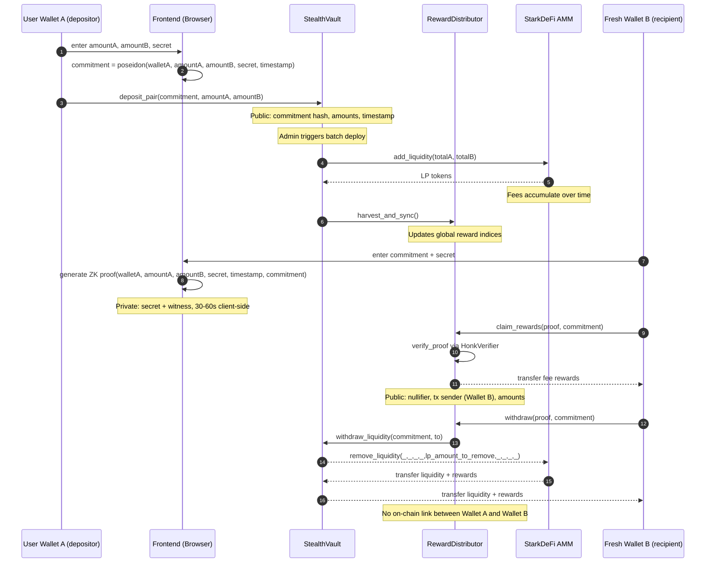

# unlinkable-lp-starknet

`unlinkable-lp` is a privacy-preserving liquidity provision prototype on Starknet. It lets users deposit tokens into an AMM liquidity pool and later claim rewards or withdraw their position from a completely different, unrelated wallet — with no on-chain link between the depositor and the recipient.

Most LP positions on AMMs are fully transparent: the wallet that deposits, the amount, and the timing are all visible on-chain, making LP positions trivially traceable. This project explores a middle ground: public deposit mechanics, private ownership claims.

The core design uses a zero-knowledge circuit (Noir) and a bundled Starknet verifier (UltraHonk + Cairo HonkVerifier). At deposit time, the user commits a Poseidon hash of their secret. To claim rewards or withdraw, the app generates a proof in-browser that shows the user knows the secret behind their commitment, without revealing which wallet originally deposited.

The contract verifies this proof and only processes the claim or withdrawal if:

1. the commitment exists in the vault,
2. the ZK proof is valid,
3. the position has not already been withdrawn.

This means a user can deposit from Wallet A and withdraw from Wallet B — the protocol has no way to link the two.

The implementation includes:

- Noir circuit for commitment ownership constraints,
- Barretenberg UltraHonk proof generation (client-side, in-browser),
- Bundled Cairo HonkVerifier (no external Garaga dependency),
- Cairo vault contract with batch deploy to StarkDeFi AMM,
- Cairo reward distributor with per-commitment fee index accounting,
- React/Vite frontend for deposit, proof generation, claim, and withdrawal.

For the Re{define} Privacy track, this project demonstrates that LP position ownership can be made unlinkable using ZK proofs, without requiring protocol-level changes to the AMM itself.

---

## Privacy model: commitment, proof, and visibility

### 1) Deposit (commitment phase)

- User chooses a private `secret` (never published).
- User computes `commitment = poseidon(walletAddress, amountA, amountB, secret, timestamp)` locally.
- User calls `deposit(commitment, amountA, amountB)` from their wallet.
- Contract stores deposit info keyed by commitment hash.

What this gives:
- The contract can later verify that a claim or withdrawal comes from someone who knows the secret behind a registered commitment.
- The secret is never revealed on-chain.

### 2) Claim / Withdraw (proof phase)

- User provides `commitment + secret` in the browser.
- Frontend generates a ZK proof locally (30–60 seconds, no server).
- `RewardDistributor` contract verifies the proof on-chain via the bundled `HonkVerifier`.
- If valid: rewards are sent or LP position is unwound.

What this gives:
- The user can submit this proof from any wallet — no link to the original depositor.
- Position details (amounts, claimable fees) are hidden in the frontend until the proof is generated.

### 3) What others can see vs cannot see

Public (visible on-chain):
- Commitment hash.
- Deposited amounts and batch ID (stored in vault state, readable by anyone who knows the commitment).
- The wallet address that submits the claim/withdrawal transaction.
- Final reward indices and tally.

Not public:
- `secret`.
- Which wallet originally deposited (if the user claims/withdraws from a different wallet).
- Witness internals used to generate the proof.

### 4) Important current limitation

**Deposit privacy is not solved.**

The deposit transaction itself is fully visible: the depositing wallet address, token amounts, and timing are all on-chain. An adversary watching the chain can correlate deposits and withdrawals by amount and timing, especially when the anonymity set (number of deposits in the pool) is small.

Full deposit privacy would require a protocol that hides the deposit amount and decouples the depositing identity from the vault entry — for example, a Tongo instance for the custom token pair used in this demo (`cETH`/`cUSDC`). No such Tongo instance currently exists on Sepolia for these tokens, making deposit-level privacy out of scope for this demo.

**What is fully functional:**
The ZK-based claim/withdraw privacy layer works end-to-end. If a user deposits from one wallet and claims/withdraws from a fresh, unrelated wallet, there is no on-chain link between the two.

### 5) Why still useful

- Prevents anyone from draining a position without knowing the secret.
- LP position ownership is cryptographically private — no wallet needs to appear in both the deposit and the withdrawal.
- Provides a base architecture for private LP on Starknet that can be extended with deposit privacy once Tongo (or equivalent) supports the relevant token pair.

---

## Flow diagram



### Flow diagram (text fallback)

```
User Wallet A + Frontend
  -> Local only: choose secret
  -> Local only: commitment = poseidon(walletA, amountA, amountB, secret, timestamp)
  -> StealthVault: deposit(commitment, amountA, amountB)
  -> Public state: commitment hash, amounts, timestamp

Admin
  -> StealthVault: batch_deploy_liquidity()
  -> StarkDeFi AMM: add_liquidity(totalPendingA, totalPendingB)
  -> Public state: LP tokens minted to vault

Admin
  -> StealthVault/RewardDistributor: harvest_and_sync()
  -> Public state: updated global reward indices

Fresh Wallet B + Frontend
  -> Local only: enter commitment + secret
  -> Local only: generate proof(walletA, amountA, amountB, secret, timestamp, commitment)
  -> RewardDistributor: claim_rewards(proof, commitment) or withdraw(proof, commitment)

RewardDistributor
  -> HonkVerifier: verify proof
  -> Checks:
     1) commitment exists in vault
     2) proof is valid
     3) position not already withdrawn
  -> State update: transfer rewards or unwind LP position to Wallet B

Publicly visible after claim/withdraw:
  - commitment hash
  - tx sender (Wallet B — not linked to Wallet A)
  - transferred amounts
  - updated reward indices

Never revealed:
  - secret
  - that Wallet A == original depositor
  - witness internals
```

---

## Folder structure

```
unlinkable-lp-starknet/
├── circuit/                    # Noir ZK circuit
│   ├── src/main.nr             # Commitment ownership circuit
│   ├── Nargo.toml
│   ├── Prover.toml
│   ├── convert_binary_proof_to_cairo.py
│   └── extract_noir_values.py
├── contract/                   # Cairo smart contracts
│   ├── src/
│   │   ├── interfaces/         # i_stealth_vault, i_reward_distributor, stark_defi
│   │   ├── mocks/              # mock_erc20, mock_starkdefi, mock_verifier
│   │   ├── verifier/           # Bundled HonkVerifier (honk_verifier.cairo + constants)
│   │   ├── stealth_vault.cairo
│   │   ├── reward_distributor.cairo
│   │   └── lib.cairo
│   ├── tests/
│   ├── Scarb.toml
│   ├── snfoundry.toml
│   └── deployment.txt
└── frontend/                   # Vite + React + TypeScript
    └── src/
        ├── circuits/           # circuit.json, verifier.json, vk.bin (bundled artifacts)
        ├── components/         # UI components (shadcn/ui)
        ├── constants/          # abis.ts, addresses.ts
        ├── hooks/              # WalletContext, use-proof, use-deposit
        ├── lib/                # starknet.ts, commitment.ts, proof-helper.ts, store.ts
        └── pages/              # Landing, Deposit, Dashboard, Claim, Withdraw, GenerateProof, Faucet
```

---

## Quick start

```bash
git clone https://github.com/0xMoZi/unlinkable-lp-starknet
cd unlinkable-lp-starknet
```

### Run frontend

```bash
cd frontend
npm install
npm run dev
# → http://localhost:8080
```

### Build contracts

```bash
cd contract
scarb build
```

### Run contract tests

```bash
cd contract
scarb test
```

### Compile ZK circuit

```bash
cd circuit
nargo compile
```

To regenerate verifier constants after circuit changes:

```bash
# After nargo compile, regenerate vk and rebuild verifier constants
bb write_vk --scheme ultra_honk --oracle_hash keccak -b ./circuit/target/circuit.json -o ./circuit/target
python3 extract_noir_values.py
# Then rebuild contracts: scarb build
```

---

## Notes

- `circuit/Prover.toml` has placeholder values. The frontend computes the correct witness automatically from user input.
- The `verifier/` folder contains the HonkVerifier bundled directly into the contract — no external Garaga calls at runtime.
- Secrets and raw deposit amounts (`rawAmountA`, `rawAmountB`) are stored in `localStorage` at deposit time. These are required as proof inputs. Clearing browser storage makes proof generation impossible for those deposits.
- For maximum privacy: use a fresh wallet (never associated with the depositor) when claiming or withdrawing. The ZK proof handles ownership verification without wallet identity.
- Deposit privacy requires a Tongo instance for `cETH`/`cUSDC`, which does not currently exist on Sepolia. This is the primary limitation of the current demo. The ZK-based claim/withdraw privacy layer is fully functional.
- Position getter functions on the contract (get_deposit_info, get_claimable_amount, etc.) are public and do not require a ZK proof. Anyone with a commitment hash can query position data directly via a block explorer or RPC, bypassing the frontend entirely. Privacy is currently enforced at the UI layer only, not at the contract layer.

---

## What should be improved

1. Contract-level privacy for getter functions (critical) — All position data getter functions (get_deposit_info, get_claimable_amount, get_lp_share, etc.) are public view functions on the contract. Anyone with a commitment hash can query them directly via a block explorer (Voyager, Starkscan) or any RPC call, completely bypassing the frontend. This means privacy is currently enforced only at the UI layer, not at the contract layer. The ZK proof requirement lives only in the frontend — it is not enforced by the contract for read operations.
The proper fix is to either: (a) remove all public getter functions and only expose position data as a side effect of the ZK-gated claim_rewards / withdraw calls, accepting that users cannot "check" a position without acting on it; or (b) return encrypted data from getters that only the secret holder can decrypt client-side — keeping getters useful while making raw data unreadable to observers.

2. Deposit privacy — Integrate with a privacy layer (e.g., Tongo) to hide deposit amounts and decouple the depositing wallet from the vault entry. Currently blocked by the absence of a Tongo instance for custom token pairs on Sepolia.

3. Fixed denomination deposits — Accepting only fixed amounts (e.g., 0.1 cETH + 100 cUSDC) would eliminate amount-based correlation attacks at the cost of UX flexibility.

4. Larger anonymity set — Privacy guarantees strengthen with more deposits in the pool. A small anonymity set makes timing/amount correlation feasible even without deposit-level privacy.

5. Relayer for claim/withdraw — Currently the wallet that submits the claim/withdraw transaction is still visible. A relayer network would decouple the transaction sender from the recipient address entirely.

6. Secret recovery — Currently there is no way to recover a position if the secret or localStorage data is lost. An encrypted backup scheme (e.g., storing an encrypted secret on IPFS keyed by commitment) would improve resilience.

---

## References

- https://docs.tongo.cash/sdk/overview.html
- https://noir-lang.org/docs
- https://github.com/keep-starknet-strange/garaga
- https://starkdefi.com/
- https://thebojda.medium.com/how-i-built-an-anonymous-voting-system-on-the-ethereum-blockchain-using-zero-knowledge-proof-d5ab286228fd
- https://espejel.bearblog.dev/starknet-privacy-toolkit/
